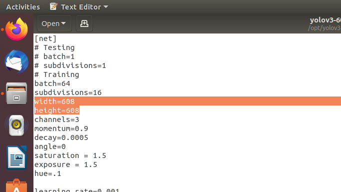

# Запуск Yolov3 и Yolov3-tiny средствами TensorRT #
### Переводим нейронную сеть из формата DarkNet в формат ONNX: ###
Устанавливаем зависимости для python3, которые написаны в **requirements.txt**(onnx==1.4.1, версия выше не подойдет)
```bash
cd yolov3_onnx/
pip3 install -r requirements.txt
```
Скачиваем файлы весов:
- - - - - - - - - - - - - - - - -
1. [Yolov3-608](https://pjreddie.com/media/files/yolov3.weights) 
2. [Yolov3-tiny-416](https://pjreddie.com/media/files/yolov3-tiny.weights) 
- - - - - - - - - - - - - - - - -
Сохраняем в папке **yolov3_onnx/** и меняем название на yolov3-608.weights/yolov3-tiny-416.weights или указываем свои пути в yolov3_to_onnx.py(переменные cfg_file_path и weights_file_path). 
Запускаем **yolov3_to_onnx.py**:
```bash
python3 yolov3_to_onnx.py --model <model_name>
```
<model_name> равно либо yolov3-608, либо yolov3-tiny-416.
Если выводит все слои, но в конце выдает ошибку, скорее всего проблема в неправильной версии onnx.
### Переводим нейронную сеть из формата ONNX в формат TensorRT и строим engine ###
Меняем переменную onnx_file_path в файле **onnx_to_tensorrt.py** и указываем свой путь до файла, если нужно. 
Запускаем **onnx_to_tensorrt.py**:
```bash
python3 onnx_to_tensorrt.py --model yolov3-608
python3 onnx_to_tensorrt.py --model yolov3-tiny-416
```
Если все прошло успешно, должен появиться файл <model_name>.trt.
### Запускаем обнаружение объектов в реальном времени ###
```bash
cd ../
python3 trt_yolov3.py --model <model_name> --usb --vid <camera_index>
```
model_name равно либо yolov3-608, либо yolov3-tiny-416.
<camera_index> обычно равен нулю. Для просмотра всех параметров программы:
```bash
python3 trt_yolov3.py --help
```
# Запуск сети произвольного размера изображения
Речь идет о размере изображения, который в итоге пойдет на обработку сети, а не о размера изображения полученного с камера/с жесткого диска.
Для начала скачиваем *.cfg файл полноценной или tiny версии YOLO. Затем в этом файле меняем переменные width и height на произвольные кратные 32, естественно width=height.

Файл весов изменять не надо. Сохраняем файлы как, **yolov3-<dimension_size>.cfg** и **yolov3-<dimension_size>.weights** 
или **yolov3-tiny-<dimension_size>.cfg** и **yolov3-tiny-<dimension_size>.weights.**

Проделываем те же шаги, что описаны выше, указывая --model_name **yolov3-<dimension_size>** или **yolov3-tiny-<dimension_size>.**